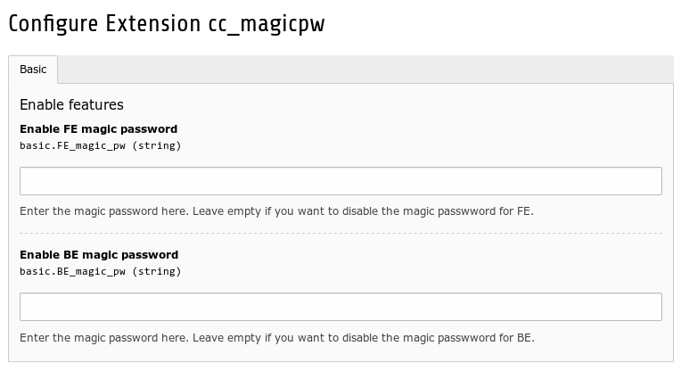
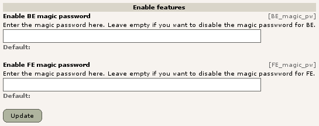

.. ==================================================
.. FOR YOUR INFORMATION
.. --------------------------------------------------
.. -*- coding: utf-8 -*- with BOM.

.. include:: ../Includes.txt

.. _admin-manual:

Administrator Manual
====================

Installation
------------

There are two ways to properly install the extension.

1. Composer installation
^^^^^^^^^^^^^^^^^^^^^^^^

In case you use Composer to manage dependencies of your TYPO3 project,
you can just issue the following Composer command in your project root directory.

.. code-block:: bash

	composer require colorcube/cc-magicpw

2. Installation with Extension Manager
^^^^^^^^^^^^^^^^^^^^^^^^^^^^^^^^^^^^^^

Download and install the extension with the extension manager module.

Configuration
-------------

The service has to be configured in the extension manager:

Enter your wanted magic passwords to enable the feature.

History
^^^^^^^

By the way, that's how TYPO3 looked in 2004:

    Configuration in 2004